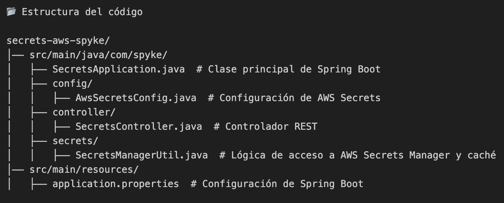
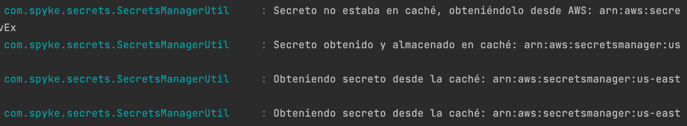

# Secrets AWS Spyke

📌 Descripción

Este proyecto es un servicio en Spring Boot que permite gestionar secretos almacenados en AWS Secrets Manager de manera eficiente mediante el uso de caché. La primera vez que se solicita un secreto, se obtiene de AWS y se almacena en memoria. Las solicitudes posteriores recuperan el secreto directamente desde la caché, evitando accesos innecesarios y reduciendo costos.

🚀 Características

Obtención de secretos desde AWS Secrets Manager
Uso de caché para evitar múltiples llamadas a AWS
Endpoints REST para recuperar secretos individuales o todos los secretos almacenados
Logs detallados para saber si el secreto proviene de AWS o de la caché

🛠️ Tecnologías utilizadas

Java 17

Spring Boot 3

AWS SDK v2

Maven

📂 Estructura del código

esquema de secreto usado

{\"PRUEBA_SECRETOS\":\"1\",\"PRUEBA_SPYKE\":\"2\",\"USER\":\"Reynaldo\"}

🔥 Implementación

SecretsManagerUtil.java
Objetivo: Manejar la obtención de secretos desde AWS Secrets Manager con un mecanismo de caché.

Métodos principales:
init(): Inicializa el cliente de AWS Secrets Manager.

loadSecret(): Carga el secreto desde AWS solo si no está en caché.

fetchSecret(String secretArn): Obtiene el secreto directamente desde AWS Secrets Manager.

getSecret(String secretArn): Devuelve el secreto, ya sea desde la caché o AWS si no está almacenado.

getAllSecrets(): Devuelve todos los secretos almacenados en caché.

SecretsController.java

Objetivo: Exponer endpoints REST para acceder a los secretos.

Endpoints disponibles:

GET /secrets/get → Obtiene un secreto específico desde AWS o caché.

GET /secrets/all → Obtiene todos los secretos almacenados en caché.

2️⃣ Ejecutar el servicio

mvn spring-boot:run

3️⃣ Probar los endpoints

✅ Obtener un secreto (carga desde AWS en la primera llamada, caché en las siguientes)
curl http://localhost:8080/secrets/get

✅ Obtener todos los secretos almacenados en caché
curl http://localhost:8080/secrets/all

📢 Logs de ejemplo
Primera llamada (se carga desde AWS):

📡 Cargando secreto desde AWS por primera vez: 

arn:aws:secretsmanager:us-east-1:123456789:secret:PRUEBA_SECRETOS_DEV

✅ Secreto almacenado en caché: 

arn:aws:secretsmanager:us-east-1:123456789:secret:PRUEBA_SECRETOS_DEV

Llamadas posteriores (desde caché):

🗄️ Obteniendo secreto desde la caché: 

arn:aws:secretsmanager:us-east-1:123456789:secret:PRUEBA_SECRETOS_DEV

